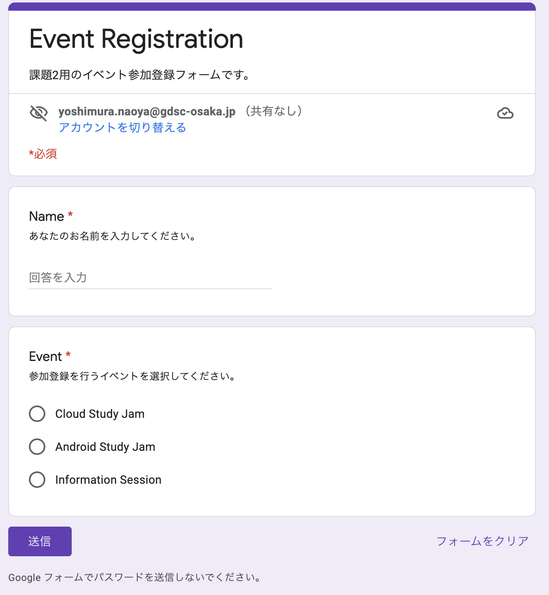

# Lesson.3: (スキルアップ問題) アンケートの回答確認とリマインダーの自動送信

Lesson.2では、名簿に書かれた全員にメールを送る方法を学習しました。
ここでは、Google Formでのアンケートの解答状況に応じて、アンケートみ回答者のみにリマインダーのメールを送るシステムを実装してください。

## 事前準備

1. Googleフォームを作成し、スプレッドシートに結果を記録
1. 回答を記録するスプレッドシートに、シートを追加し、回答が必要な人の名簿を作成
1. Google Formに、異なるユーザとして何件か回答を登録してください。

参考:
- [Google Form - L3-TASK2_EventRegistrationForm](https://forms.gle/hEzP1vM58argDEd38)
- [Google Spreadsheet - L3_Task2](https://docs.google.com/spreadsheets/d/10zmHFS31KOl7HFMwV6qnRGUXCkLGbt8HK38tEH7ZtX8/edit?usp=sharing) (回答記録用シート)



**Sheet: MemberList:**

| Name   | Email                 |
|--------|-----------------------|
| Ichiro | xxxx+ichiro@gmail.com |
| Jiro   | xxxx+jiro@gmail.com   |
| Saburo | xxxx+saburo@gmail.com |

**Sheet: Form Responses:**

| Timestamp             | Name   | Event               |
|-----------------------|--------|---------------------|
| 12/5/2021 19:53:35    | Ichiro | Cloud Study Jam     |
| 12/5/2021 19:53:42    | Jiro   | Information Session |
| 12/5/2021 19:53:49    | Saburo | Cloud Study Jam     |


## 課題説明

作成したSpreadsheetに紐付いたApp Scriptを作成し、回答の登録がないユーザのみにリマインダーのメールを送信してください。

大まかな実装手順を以下に示すので、参考にしてください。

- スプレッドシートに紐付いたApp Scriptを作成
- アンケートに回答すべき人、回答した人のリストを取得
- 回答すべき人と未回答者の氏名を比較し、未回答者のリストを作成
- 未回答者に対して、リマインダーのメールを送信

(ヒントはワークショップ中に示されるかもしれません！)

## 実装のヒント

1から実装が難しい方向けに、実装の手順を説明します。

以下には、中身がない関数と、テスト関数を書きました。
テスト関数には想定する入出力の例が書かれています。
この入力に対して、書かれた出力を返す関数を、中身がない関数に実装してください。

### Step.1: Google Formの回答の検索

```js
/**
 * メンバーデータ (members)に含まれる一人一人の名前が、回答シートにあるか確認します。
 * 回答が見つかれば、 回答が登録されている行番号を、未解答の場合は-1を格納した配列を返します。
 * 配列の検索には indexOf()と、Underscore.zip.apply()を用いると良いかも。
 * 
 * @param {Array} シート "members" から読み出したデータ (2D Array)
 * @param {Array} シート "Form Response" から読み出したデータ(2D Array) 
 * @return {Array} 回答が登録されている行番号のリスト。
 */
function getResponsRows(members, responses){
  // ここを実装！
}

function testGetResponsRows(){
  // Input
  var members = [
    ["Ichiro", "xxxx+ichiro@gmail.com"],
    ["Jiro",  "xxxx+jiro@gmail.com"],
    ["Saburo", "xxxx+saburo@gmail.com"],
    ["Shiro", "xxxx+shiro@gmail.com"],
    ["Goro", "xxxx+goro@gmail.com"],
  ];
  var responses = [
    ["12/5/2021 19:53:35", "Ichiro", 	"Cloud Study Jam"],
    ["12/5/2021 19:53:42", 	"Jiro", "Information Session"],
    ["12/5/2021 19:53:49",  "Saburo", "Cloud Study Jam"],
  ];

  // Output
  var outputExpected = [0, 1, 2, -1, -1];

  output = getResponsRows(members, responses);
  Logger.log("Unit-Test: output=%s", output);
  // >> [0, 1, 2, -1, -1]
}
```

### Step.2: 未回答者のリストの作成

```js
/**
 * 未回答者のリストを返す。
 * 
 * @param {Array} members
 * @param {Array} responseRows 回答の行番号を格納した配列。 (i.e., getResponsRows()の結果)
 */
function getNoResponseMemberList(members, responseRows){
  // ここに実装!
  // Step.1で実装した、getResponsRows() をうまく活用してください!
}


function testGetNoResponseMemberList(){
  // Input
  var members = [
    ["Ichiro", "xxxx+ichiro@gmail.com"],
    ["Jiro",  "xxxx+jiro@gmail.com"],
    ["Saburo", "xxxx+saburo@gmail.com"],
    ["Shiro", "xxxx+shiro@gmail.com"],
    ["Goro", "xxxx+goro@gmail.com"],
  ];
  var responses = [
    ["12/5/2021 19:53:35", "Ichiro", 	"Cloud Study Jam"],
    ["12/5/2021 19:53:42", 	"Jiro", "Information Session"],
    ["12/5/2021 19:53:49",  "Saburo", "Cloud Study Jam"],
  ];

  // Output
  var outputExpected = [
    ["Shiro", "xxxx+shiro@gmail.com"],
    ["Goro", "xxxx+goro@gmail.com"],
  ];

  output = getResponsRows(members, responses);
  Logger.log("Unit-Test: output=%s", output);
  Logger.log("Unit-Test: outputExpected=%s", outputExpected);
}
```


### Step.4: メールを送信

```js
/**
 * リストに登録されているアドレス全てにメールを送信可能か確認する。
 * NOTE: Gmailが1日で送信可能なメールの数は100
 * @param numEntry 
 * @returns {bool}
 */
function canSendAllEmail(numEntry){
  // 今日送信可能なメールの残数を取得
  let emailQuotaRemaining = MailApp.getRemainingDailyQuota();
  Logger.log("本日送信可能メール数:", emailQuotaRemaining);

  // 確認 (残数的に全件送信可能 ==> true, 不可 ==> false)
  if (numEntry < emailQuotaRemaining){
    return true;
  } 
  return false;
}

/**
 * メンバーのリスト(氏名とEmail)を受け取り、個別にメールを送信する。
 * 
 * @param {Array} members
 */
function sendEmails(members){
  // ここに実装
}

function testSendEmails(){
  var notRespondesMembers = [
    ["Shiro", "xxxx+shiro@gmail.com"],
    ["Goro", "xxxx+goro@gmail.com"],
  ];

  sendEmails(notRespondesMembers);
  Logger.log("Unit-Test: Done!");
}
```

## 追加課題
上記の実装ができた方は、追加で以下の課題にも取り組んでみてください！

- `MemberList` に回答の有無を記録した列の追加
- 送信するメールのHTML化
- トリガーを使った定期実行
